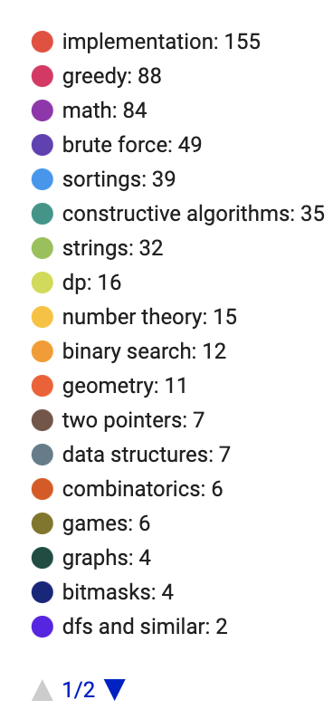

# Codeforces-Challenge
Implementation for solutions of differents problems.

The challenge is about of 100 problems type A, 100 problems type B and 50 problems type C.

[Challenge CodeForces](https://codeforces.com/blog/entry/82143)

## To do!
- [x] Solve 100 problems type A
- [x] Solve 100 problems type B
- [x] Solve 50 problems type C

### Top 18 tags topics

